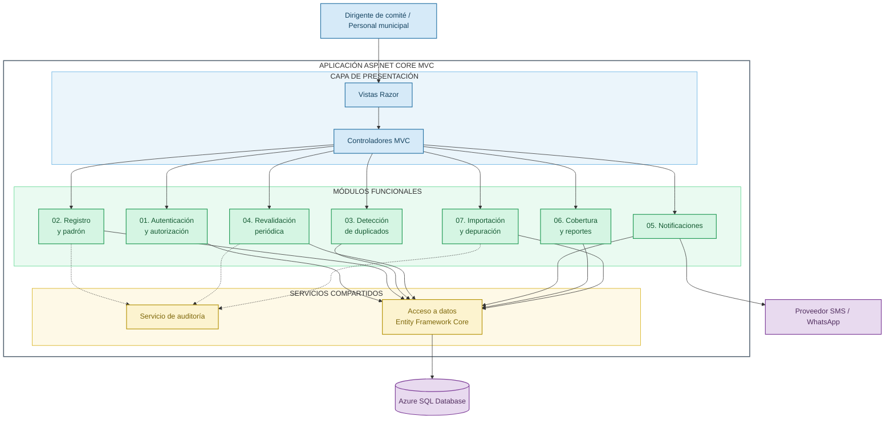

## C4 - Nivel 3: Diagrama de Componentes

```mermaid
flowchart TB
    usuario["Dirigente de comité / Personal municipal"]

    subgraph aplicacion["APLICACIÓN ASP.NET CORE MVC"]
        direction TB

        subgraph presentacion["CAPA DE PRESENTACIÓN"]
            direction LR
            vistas["Vistas Razor"]
            controladores["Controladores MVC"]
            vistas --> controladores
        end

        subgraph funcional["MÓDULOS FUNCIONALES"]
            direction TB

            subgraph fila1[" "]
                direction LR
                m1["01. Autenticación<br/>y autorización"]
                m2["02. Registro<br/>y padrón"]
                m3["03. Detección<br/>de duplicados"]
                m4["04. Revalidación<br/>periódica"]
            end

            subgraph fila2[" "]
                direction LR
                m5["05. Notificaciones"]
                m6["06. Cobertura<br/>y reportes"]
                m7["07. Importación<br/>y depuración"]
            end
        end

        subgraph soporte["SERVICIOS COMPARTIDOS"]
            direction LR
            auditoria["Servicio de auditoría"]
            datos["Acceso a datos<br/>Entity Framework Core"]
        end

        controladores --> m1
        controladores --> m2
        controladores --> m3
        controladores --> m4
        controladores --> m5
        controladores --> m6
        controladores --> m7

        m1 --> datos
        m2 --> datos
        m3 --> datos
        m4 --> datos
        m5 --> datos
        m6 --> datos
        m7 --> datos

        m2 -.-> auditoria
        m4 -.-> auditoria
        m7 -.-> auditoria
    end

    bd[("Azure SQL Database")]
    proveedor["Proveedor SMS / WhatsApp"]

    usuario --> vistas
    datos --> bd
    m5 --> proveedor

    classDef actor fill:#D6EAF8,stroke:#2874A6,color:#154360,stroke-width:1.5px
    classDef presentacion fill:#D6EAF8,stroke:#2874A6,color:#154360,stroke-width:1.5px
    classDef modulo fill:#D5F5E3,stroke:#239B56,color:#145A32,stroke-width:1.5px
    classDef soporte fill:#FCF3CF,stroke:#B7950B,color:#7D6608,stroke-width:1.5px
    classDef externo fill:#E8DAEF,stroke:#7D3C98,color:#512E5F,stroke-width:1.5px

    class usuario actor
    class vistas,controladores presentacion
    class m1,m2,m3,m4,m5,m6,m7 modulo
    class auditoria,datos soporte
    class bd,proveedor externo

    style aplicacion fill:#FFFFFF,stroke:#566573,stroke-width:2px
    style presentacion fill:#EBF5FB,stroke:#5DADE2,stroke-width:1px
    style funcional fill:#EAFAF1,stroke:#58D68D,stroke-width:1px
    style soporte fill:#FEF9E7,stroke:#D4AC0D,stroke-width:1px
    style fila1 fill:transparent,stroke:transparent
    style fila2 fill:transparent,stroke:transparent
```
